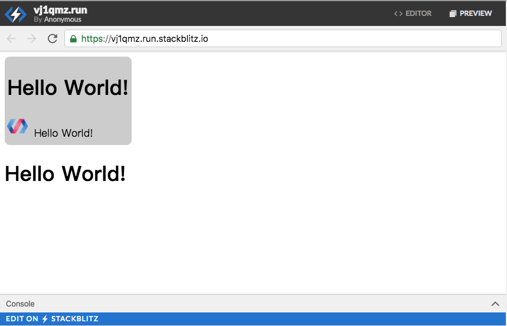
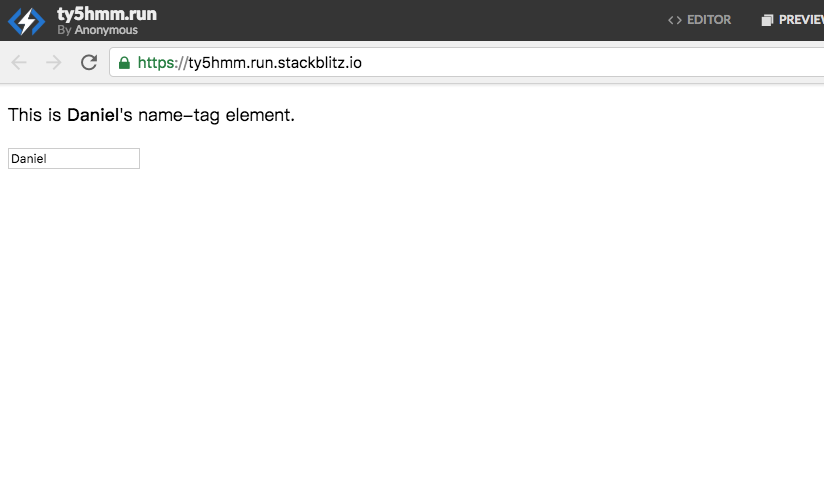
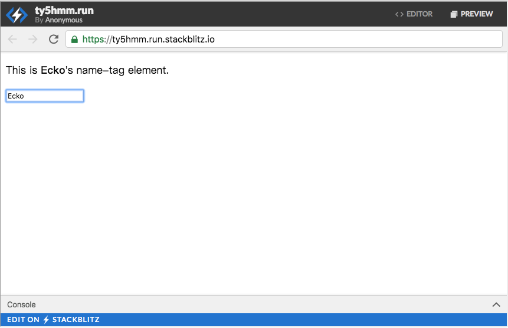
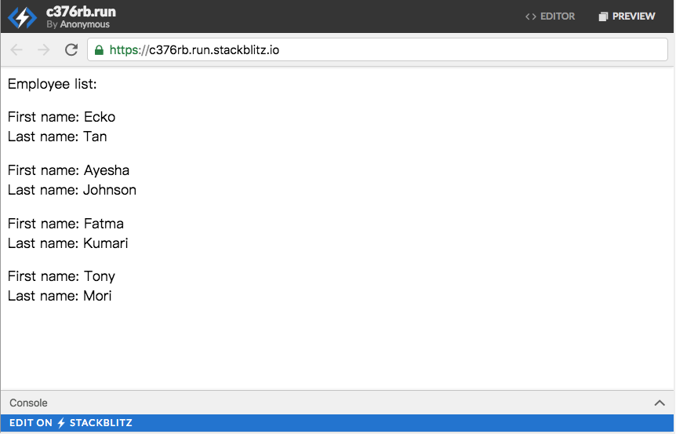

# Fundamental Polymer Concepts with simple examples


**source: https://www.polymer-project.org/3.0/start/quick-tour#register**


Polymer makes it simple to create web components, declaratively.

New web developers can simply add custom HTML elements on a web page with markup. It’s just like using the HTML tags you’re already familiar with:

```html
<h1>A heading!</h1>
```

```html
<fancy-thing>A fancy thing!</fancy-thing>
```

Experienced web developers can use Polymer's special features to reduce boilerplate and make it even easier to build complex, interactive elements. In this tour, you'll learn how to:

- Register elements
- Use lifecycle callbacks
- Observe properties
- Create shadow DOM with templates
- Use data binding


##Register an element

To register a new element, 

1. create an ES6 class that extends `PolymerElement`, 
2. then call the `customElements.define` method, which *registers* a new element with the browser. Registering an element associates an element name with a class, so you can add properties and methods to your custom element. The custom element's name **must start with an ASCII letter and contain a dash (-)**.


custom-element.js:

~~~javascript
import {PolymerElement} from '@polymer/polymer/polymer-element.js';

// Define the class for a new element called custom-element
class CustomElement extends PolymerElement {
  constructor() {
    super();
    this.textContent = 'I\'m a custom-element.';
    console.log(this.tagName);
  }
}
// Register the new element with the browser
customElements.define('custom-element', CustomElement);
~~~

index.html

~~~html
<!DOCTYPE html>
<html lang="en">
  <head>
    <script src="./node_modules/@webcomponents/webcomponentsjs/custom-elements-es5-adapter.js"></script>
    <script src="./node_modules/@webcomponents/webcomponentsjs/webcomponents-loader.js"></script>
  </head>
  <body>
    <!-- Use the custom-element just like using the normal html element -->
    <custom-element></custom-element>
  </body>
</html>
~~~

index.js:

~~~javascript
import './custom-element.js';

~~~

This sample uses a lifecycle callback to add contents to the `<custom-element>` when it's initialized. When a custom element finishes its initialization, the `ready` lifecycle callback is called. You can use the `ready` callback for one-time initialization work after the element is created.


## Add shadow DOM


About shadow DOM:

+ https://developer.mozilla.org/en-US/docs/Web/Web_Components/Using_shadow_DOM
+ http://www.cnblogs.com/coco1s/p/5711795.html


Many elements include some internal DOM nodes to implement the element's UI and behavior. You can use Polymer's DOM templating to create a shadow DOM tree for your element.


~~~javascript
import {PolymerElement, html} from '@polymer/polymer/polymer-element.js'

// Define the class for a new element called custom-element
class DomElement extends PolymerElement {

  static get template () {
    return html`
      <p>I'm a DOM element. This is my shadow DOM!</p>

      <!-- TODO: Try adding some other html elements inside the
           template. For example, add <h1>A heading!</h1> or
           <a href="stuff.html">A link!</a>
      -->
      <h1>A heading</h1>
      <a href="stuff.html">A link</a>
    `;
  }
}
// Register the new element with the browser
customElements.define('dom-element', DomElement);
~~~


## Compose with shadow DOM

Shadow DOM lets you control *composition*. The element's children can be *distributed* so they render as if they were inserted into the shadow DOM tree.


~~~javascript
import {PolymerElement, html} from "@polymer/polymer/polymer-element.js"

class PictureFrame extends PolymerElement {
  static get template() {
    return html`
    <!-- scoped CSS for this element -->
    <style>
      div {
        display: inline-block;
        background-color: #ccc;
        border-radius: 8px;
        padding: 4px;
      }
    </style>

    <!--
    TODO: Try adding other HTML elements to the DOM template
    to see how they are positioned relative to the distributed
    child nodes.
    -->
    
	<div>
      <h1>Hello World!</h1>
      <slot>Hello!</slot>
      <div>Hello World!</div>
    </div>

    <h1>Hello World!</h1>
    `;
  }
}
customElements.define('picture-frame', PictureFrame);

~~~


The index.html:





"Hello World" inside the `<div> </div>` has the style defined by the css, while "Hello World" outside the `<div> </div>` doesnt.


## Use data binding

Of course, it's not enough to have static shadow DOM. You usually want to have your element update its shadow DOM dynamically.

Data binding is a great way to quickly propagate changes in your element and reduce boilerplate code. **You can bind properties in your component using the "double-mustache" syntax (`{{}}`). The `{{}}` is replaced by the value of the property referenced between the brackets.**


~~~javascript
import {PolymerElement, html} from "@polymer/polymer/polymer-element.js"

class NameTag extends PolymerElement {
  constructor() {
    super();

    /* set this element's owner property */
    this.owner = 'Ecko';
    this.word = 'Hello World';
  }
  static get template() {
    return html`
      <!-- bind to the "owner" property -->
       <b>{{owner}}</b> says {{word}}.
    `;
  }
}
customElements.define('name-tag', NameTag);

~~~




## Declare a property

Polymer *declared properties* support a number of common patterns for properties—setting default values, configuring properties from markup, observing property changes, and more.

The following example declares the `owner` property from the last example. It also shows configuring the owner property from markup in `index.html`.


configurable-name-tag.js

~~~javascript
import {PolymerElement, html} from '@polymer/polymer/polymer-element.js'

class ConfigurableNameTag extends PolymerElement {
  static get properties () {
    return {
      // Configure owner property
      owner: {
        type: String,
        value: 'Daniel',
      }
    };
  }
  static get template () {
    return html`
      <!-- bind to the "owner" property -->
      This is <b>[[owner]]</b>'s name-tag element.
    `;
  }
}
customElements.define('configurable-name-tag', ConfigurableNameTag);
~~~

index.html:

~~~html
<!DOCTYPE html>
<html lang="en">
  <head>
    <script src="./node_modules/@webcomponents/webcomponentsjs/custom-elements-es5-adapter.js"></script>
    <script src="./node_modules/@webcomponents/webcomponentsjs/webcomponents-loader.js"></script>
  </head>
  <body>
    <!-- configure a property from markup by setting
         the corresponding attribute:
    -->
    <configurable-name-tag owner="Scott"></configurable-name-tag>
    <!--
      TODO: Try editing the initial value of `owner` in
      index.html. Observe how this sets the property directly
      from your HTML.
    -->
  </body>
</html>
~~~

+ In `configurable-name-tag.js`, the default owner is set as "Daniel".  Which means, if we don't set any value for property `owner` in \<configuable-name-tag> in `index.html`, the result will be 

  ~~~
  This is Daniel's name-tag element.
  ~~~

+ If we set our own value for property `owner` in \<configuable-name-tag> in index.html, i.e.

  ~~~html
  <configurable-name-tag owner="Scott"></configurable-name-tag>
  ~~~

  The result will be:

  ~~~
  This is Scott's name-tag element.
  ~~~


## Bind to a property

In addition to text content, you can bind to an element's *properties* (using `property-name="[[binding]]"`). Polymer properties can optionally support two-way binding, using curly braces (`property-name="{{binding}}"`).


The following example uses two-way binding: binding the value of a custom input element **(`iron-input`)** to the element's `owner` property, so it's updated as the user types.i

~~~javascript
import {PolymerElement, html} from '@polymer/polymer/polymer-element.js';
import '@polymer/iron-input/iron-input.js';

class EditableNameTag extends PolymerElement {
  static get properties () {
    return {
      owner: {
        type: String,
        value: 'Daniel'
      }
    };
  }
  static get template () {
    return html`
      <!-- bind to the 'owner' property -->
      <p>This is <b>[[owner]]</b>'s name-tag element.</p>

      <!-- iron-input exposes a two-way bindable input value -->
      <iron-input bind-value="{{owner}}">
        <!--
          TODO: Edit the placeholder text to see two-way data
          binding at work.
        -->
      <input is="iron-input" placeholder="Your name here...">
      </iron-input>
    `;
  }
}

customElements.define('editable-name-tag', EditableNameTag);

~~~

> **Note:** The `<iron-input>` element wraps a native `<input>` element and provides two-way data binding and input validation.

index.html:

~~~html
<!DOCTYPE html>
<html lang="en">
  <head>
    <script src="./node_modules/@webcomponents/webcomponentsjs/custom-elements-es5-adapter.js"></script>
    <script src="./node_modules/@webcomponents/webcomponentsjs/webcomponents-loader.js"></script>
  </head>
  <body>
    <editable-name-tag></editable-name-tag>
  </body>
</html>

~~~

When we enter something into the input-box, the shown-value of `owner` will be changed dynamically and automaically, since the value of `owner` is binded to the input.





## Using

The template repeater (`<dom-repeat>`) is a specialized template that binds to an array. It creates one instance of the template's contents for each item in the array.


employee-list.js

~~~javascript
//import the Polymer library
import {PolymerElement, html} from '@polymer/polymer/polymer-element.js'

//import the template repeater
import '@polymer/polymer/lib/elements/dom-repeat.js'

class EmployeeList extends PolymerElement {
  constructor() {
    super();
    /* TODO:
     * - Change the first and last names inside this.employees
     * - Add another employee by inserting another object
     *   into the array definition after Tony Mori:
     *   {first: 'Shawna', last: 'Williams'}
     *   Remember to make sure your commas are correct!
     */

    this.employees = [
      {first: 'Ecko', last: 'Tan'},
      {first: 'Ayesha', last: 'Johnson'},
      {first: 'Fatma', last: 'Kumari'},
      {first: 'Tony', last: 'Mori'}
    ];
  }
  static get template () {
    return html`
    <div> Employee list: </div>
    <p></p>
    <template is="dom-repeat" items="{{employees}}">
        <div>First name: <span>{{item.first}}</span></div>
        <div>Last name: <span>{{item.last}}</span></div>
        <p></p>
    </template>
    `;
  }
}
customElements.define('employee-list', EmployeeList);

~~~

index.html:

~~~html
<!DOCTYPE html>
<html lang="en">
  <head>
    <script src="./node_modules/@webcomponents/webcomponentsjs/custom-elements-es5-adapter.js"></script>
    <script src="./node_modules/@webcomponents/webcomponentsjs/webcomponents-loader.js"></script>
  </head>
  <body>
    <employee-list></employee-list>
  </body>
</html>

~~~



> About dom-repeat: https://www.polymer-project.org/3.0/docs/api/elements/dom-repeat

