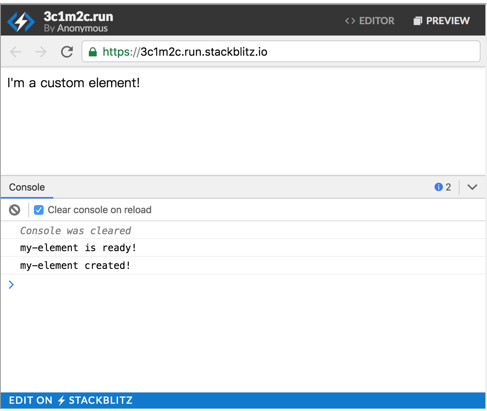

# Custom Elements (Base on Polymer 3.0)


## Custom Element Concept

Custom elements provide a component model for the web. The custom elements specification provides:

- A mechanism for associating a class with a custom element name.
- A set of lifecycle callbacks invoked when an instance of the custom element changes state (for example, added or removed from the document).
- A callback invoked whenever one of a specified set of attributes changes on the instance.

Put together, these features let you build an element with its own public API that reacts to state changes. Polymer provides a set of features on top of the basic custom element specification.

This document provides an overview of custom elements as they relate to Polymer. For a more detailed overview of custom elements, see: [Custom Elements v1: Reusable Web Components](https://developers.google.com/web/fundamentals/web-components/customelements) on Web Fundamentals.

To define a custom element, you create an ES6 class and associate it with the custom element name. For the full set of Polymer features, extend the `PolymerElement` class:

```javascript
import {PolymerElement} from '@polymer/polymer/polymer-element.js';

  export class MyPolymerElement extends PolymerElement {
    ...
  }

  customElements.define('my-polymer-element', MyPolymerElement);
```

Exporting the custom element class is optional, but recommended.

Import the element into an HTML file using `<script type="module">`.
Use the `import` statement (as shown above) to import it from another ES6 module.

```html
<script type="module" src="./my-polymer-element.js">
```

Once you've imported it, you can use a custom element just like you'd use a standard element.

The element's class defines its behavior and public API.

**Custom element names.** By specification, the custom element's name **must start with a lower-case ASCII letter and must contain a dash (-)**. There's also a short list of prohibited element names that match existing names. For details, see the [Custom elements core concepts](https://html.spec.whatwg.org/multipage/scripting.html#custom-elements-core-concepts) section in the HTML specification.

Polymer adds a set of features to the basic custom element:

- Instance methods to handle common tasks.
- Automation for handling properties and attributes, such as setting a property based on the corresponding attribute.
- Creating shadow DOM trees for element instances based on a supplied template.
- A data system that supports data binding, property change observers, and computed properties.

The `PolymerElement` class is made up of a set of *class expression mixins* that add individual features. You can also use these mixins individually if you want to use a subset of Polymer's features. See the API documentation for a list of individual mixins.


###Polymer element lifecycle

Polymer elements follow the standard lifecycle for custom elements. The custom element spec provides a set of callbacks called "custom element reactions" that allow you to run user code in response to certain lifecycle changes.

For performance, Polymer defers creating an element's shadow tree and initializing its data system until the first time the element is attached to the DOM. Polymer adds its own `ready` callback for this initialization.

| Reaction                 | Description                                                  |
| ------------------------ | ------------------------------------------------------------ |
| constructor              | Called when the element is upgraded (that is, when an element is created, or when a previously-created element becomes defined). The constructor is a logical place to set default values, and to manually set up event listeners for the element itself. |
| connectedCallback        | Called when the element is added to a document. Can be called multiple times during the lifetime of an element.Uses include adding document-level event listeners. (For listeners local to the element, you can use [annotated event listeners](https://www.polymer-project.org/3.0/docs/devguide/events#annotated-listeners).) |
| disconnectedCallback     | Called when the element is removed from a document. Can be called multiple times during the lifetime of an element.Uses include removing event listeners added in `connectedCallback`. |
| ready                    | Called during Polymer-specific element initialization. Called once, the first time the element is attached to the document. For details, see [Polymer element initialization](https://www.polymer-project.org/3.0/docs/devguide/custom-elements#ready-callback)). |
| attributeChangedCallback | Called when any of the element's attributes are changed, appended, removed, or replaced.Use to handle attribute changes that *don't* correspond to declared properties. (For declared properties, Polymer handles attribute changes automatically as described in [attribute deserialization](https://www.polymer-project.org/3.0/docs/devguide/properties#attribute-deserialization).) |

For each reaction, the first line of your implementation must be a call to the superclass constructor or reaction. For the constructor, this is simply the `super()` call.

```javascript
constructor() {
  super();
  // …
}
```

For other reactions, call the superclass method. This is required so Polymer can hook into the element's lifecycle.

```javascript
connectedCallback() {
  super.connectedCallback();
  // …
}
```

The element constructor has a few special limitations:

- The first statement in the constructor body must be a parameter-less call to the `super` method.
- The constructor can't include a return statement, unless it is a simple early return (`return` or `return this`).
- The constructor can't examine the element's attributes or children, and the constructor can't add attributes or children.

For a complete list of limitations, see [Requirements for custom element constructors](https://html.spec.whatwg.org/multipage/scripting.html#custom-element-conformance) in the WHATWG HTML Specification.

Whenever possible, defer work until the `connectedCallback` or later instead of performing it in the constructor. See [Defer non-critical work](https://www.polymer-project.org/3.0/docs/devguide/custom-elements#defer-work) for some suggestions.




### Polymer element initialization

The custom elements specification doesn't provide a one-time initialization callback. Polymer provides a `ready`callback, invoked the first time the element is added to the DOM. (If the element is upgraded when it's already in the document, `ready` runs when the element is upgraded.)

```javascript
ready() {
  super.ready();
  // do something that requires access to the shadow tree
  ... 

}
```

The `PolymerElement` class initializes your element's template and data system during the `ready` callback, so if you override `ready`, you must call `super.ready()` before accessing the element's shadow tree.

Polymer does several things at `ready` time:

- Creates and attaches the element's shadow DOM tree.
- Initializes the data system, propagating intial values to data bindings.
- Allows observers and computed properties to run (as soon as any of their dependencies are defined).

When the superclass `ready` method returns, the element's template has been instantiated and initial property values have been set. However, light DOM elements may not have been distributed when `ready` is called.

Don't use `ready` to initialize an element based on dynamic values, like property values or an element's light DOM children. Instead, use [observers](https://www.polymer-project.org/3.0/docs/devguide/observers) to react to property changes, and `observeNodes` or the `slotchange`event to react to children being added and removed from the element.

Related topics:

- [DOM templating](https://www.polymer-project.org/3.0/docs/devguide/dom-template)
- [Data system concepts](https://www.polymer-project.org/3.0/docs/devguide/data-system)
- [Observers and computed properties](https://www.polymer-project.org/3.0/docs/devguide/observers)
- [Observe added and removed children](https://www.polymer-project.org/3.0/docs/devguide/shadow-dom#observe-nodes)


### Defer non-critical work

When possible, defer work until after first paint. The [`render-status`](https://www.polymer-project.org/3.0/docs/api/utils/render-status) module provides an `afterNextRender`utility for this purpose.

```javascript
import {PolymerElement} from '@polymer/polymer/polymer-element.js';
import {afterNextRender} from '@polymer/polymer/lib/utils/render-status.js';


class DeferElement extends PolymerElement {
  ...
  constructor() {
    super();
    // When possible, use afterNextRender to defer non-critical
    // work until after first paint.
    afterNextRender(this, function() {
      this.addEventListener('click', this._handleClick);
    });
  }
}
```

In most cases, you can call `afterNextRender` from either the `constructor` or the `ready` callback with similar results. For anything requiring access to the element's shadow tree, use the `ready` callback.


###Element upgrades

By specification, custom elements can be used before they're defined. Adding a definition for an element causes any existing instances of that element to be *upgraded* to the custom class.

For example, consider the following code:

```html
<my-element></my-element>

<!-- load the elment definition -->
<script type="module" src="my-element.js">
```

**When parsing this page, the browser will create an instance of `<my-element>` before parsing and executing the script. In this case, the element is created as an instance of `HTMLElement`, not `MyElement`. After the element is defined, the `<my-element>` instance is upgraded so it has the correct class (`MyElement`). The class constructor is called during the upgrade process, followed by any pending lifecycle callbacks.**

Element upgrades allow you to place elements in the DOM while deferring the cost of initializing them. It's a progressive enhancement feature.

To avoid unstyled content, you can apply styles to undefined elements. See [Style undefined elements](https://www.polymer-project.org/3.0/docs/devguide/style-shadow-dom#style-undefined-elements) for details.


###Extending other elements

In addition to `PolymerElement`, a custom element can extend another custom element:

```javascript
import {MyElment} from './my-element.js';

export class ExtendedElement extends MyElement {
  static get is() { return 'extended-element'; }

  static get properties() {
    return {
      thingCount: {
        value: 0,
        observer: '_thingCountChanged'
      }
    }
  }
  _thingCountChanged() {
    console.log(`thing count is ${this.thingCount}`);
  }
};

customElements.define(ExtendedElement.is, ExtendedElement);
```

**Polymer does not currently support extending built-in elements.** The custom elements spec provides a mechanism for extending built-in elements, such as `<button>` and `<input>`. The spec calls these elements *customized built-in elements*. Customized built-in elements provide many advantages (for example, being able to take advantage of built-in accessibility features of UI elements like `<button>` and `<input>`). However, not all browser makers have agreed to support customized built-in elements, so Polymer does not support them at this time.

When you extend custom elements, Polymer treats the `properties` object and `observers` array specially: when instantiating an element, Polymer walks the prototype chain and flattens these objects. So the properties and observers of a subclass are added to those defined by the superclass.

A subclass can also inherit a template from its superclass. For details, see [Inherit a template from another Polymer element](https://www.polymer-project.org/3.0/docs/devguide/dom-template#inherit).

To make it easy to extend your elements, the module that defines the element should export it:

```javascript
export class MyElement extends PolymerElement { ... }
```

Legacy elements—elements defined using the legacy `Polymer()` function—don't require you to define your own class. So if you're extending a legacy element, like one of the Polymer paper elements, the module may not export a class.

If you're extending a legacy Polymer element, or a module that doesn't export the element, you can use the `customElements.get` method to retrieve the constructor for any custom element that's been defined.

```javascript
// Import a legacy component
import './legacy-button.js';
// Retrieve the legacy-button constructor
const LegacyButton = customElements.get('legacy-button');
// Extend it!
export class MyExtendedButton extends LegacyButton { ... }
```


###Sharing code with class expression mixins

ES6 classes allow single inheritance, which can make it challenging to share code between unrelated elements. Class expression mixins let you share code between elements without adding a common superclass.

A class expression mixin is basically a function that operates as a *class factory*. You pass in a superclass, and the function generates a new class that extends the superclass with the mixin's methods.

```javascript
const fancyDogClass = FancyMixin(dogClass);
const fancyCatClass = FancyMixin(catClass);
```


### Using mixins

Add a mixin to your element like this:

```javascript
class MyElement extends MyMixin(PolymerElement) {
  static get is() { return 'my-element' }
}
```

If that isn't clear, it may help to see it in two steps:

```javascript
// Create new base class that adds MyMixin's methods to Polymer.Element
const PolymerElementPlusMixin = MyMixin(PolymerElement);

// Extend the new base class
class MyElement extends PolymerElementPlusMixin {
  static get is() { return 'my-element' }
}
```

So the inheritance hierarchy is:

```javascript
MyElement <= PolymerElementPlusMixin <= PolymerElement
```

You can apply mixins to any element class, not just `PolymerElement`:

```javascript
class MyExtendedElement extends SomeMixin(MyElement) {
  ...
}
```

You can also apply multiple mixins in sequence:

```javascript
class AnotherElement extends AnotherMixin(MyMixin(PolymerElement)) { … }
```


####Defining mixins

A mixin is simply a function that takes a class and returns a subclass:

```javascript
MyMixin = function(superClass) {
  return class extends superClass {
    constructor() {
      super();
      this.addEventListener('keypress', (e) => this._handlePress(e));
    }

    static get properties() {
      return {
        bar: {
          type: Object
        }
      };
    }

    static get observers() {
      return [ '_barChanged(bar.*)' ];
    }

    _barChanged(bar) { ... }

    _handlePress(e) { console.log('key pressed: ' + e.charCode); }
  }
}
```

Or using an ES6 arrow function:

```
MyMixin = (superClass) => class extends superClass {
  ...
}
```

The mixin class can define properties, observers, and methods just like a regular element class. In addition, a mixin can incorporate other mixins:

```javascript
MyCompositeMixin = (base) => class extends MyMixin2(MyMixin1(base)) {
  ...
}
```

Because mixins are simply adding classes to the inheritance chain, all of the usual rules of inheritance apply. For example, mixin classes can define constructors, can call superclass methods with `super`, and so on.

**Document your mixins.** The Polymer build and lint tools require some extra documentation tags to property analyze mixins and elements that use them. Without the documentation tags, the tools will log warnings. For details on documenting mixins, see [Class mixins](https://www.polymer-project.org/3.0/docs/tools/documentation#class-mixins) in Document your elements.


####Packaging mixins for sharing

When creating a mixin that you intend to share with other groups or publish, a couple of additional steps are recommended:

- Use the [`dedupingMixin`](https://www.polymer-project.org/3.0/docs/api/utils/mixin#function-dedupingMixin) function to produce a mixin that can only be applied once.
- Define the mixin in an ES module and export it.

The `dedupingMixin` function is useful because a mixin that's used by other mixins may accidentally be applied more than once. For example if `MixinA` includes `MixinB` and `MixinC`, and you create an element that uses `MixinA` but also uses `MixinB` directly:

```javascript
class MyElement extends MixinB(MixinA(Polymer.Element)) { ... }
```

At this point, your element contains two copies of `MixinB` in its prototype chain. `dedupingMixin` takes a mixin function as an argument, and returns a new, deduplicating mixin function:

mixin-b.js

```javascript
import {dedupingMixin} from '@polymer/polymer/lib/utils/mixin.js';

// define the mixin
let internalMixinB = (base) =>
  class extends base {
    ...
  }

// deduplicate and export it
export const MixinB = dedupingMixin(internalMixinB);
```

Using the mixin

```javascript
import {mixinB} from './mixin-b.js';

class Foo extends MixinB(PolymerElement) { ... }
```

The deduping mixin has two advantages: first, whenever you use the mixin, it memoizes the generated class, so any subsequent uses on the same base class return the same class object—a minor optimization.

More importantly, the deduping mixin checks whether this mixin has already been applied anywhere in the base class's prototype chain. If it has, the mixin simply returns the base class. In the example above, if you used `dedupingMixinB` instead of `mixinB` in both places, the mixin would only be applied once.


##Define a custom element

To define a custom element, **create a class that extends `PolymerElement` and pass the class to the`customElements.define` method.**

By specification, the custom element's name **must start with a lower-case ASCII letter and must contain a dash (-)**.


Example:

```javascript
// Import PolymerElement class
import {PolymerElement} from '@polymer/polymer/polymer-element.js';

// define the element's class element
class MyElement extends PolymerElement {

  // Element class can define custom element reactions
  connectedCallback() {
    super.connectedCallback();
    this.textContent = 'I\'m a custom element!';
    console.log('my-element created!');
  }

  ready() {
    super.ready();
    console.log('my-element is ready!');
  }
}

// Associate the new class with an element name
customElements.define('my-element', MyElement);

// create an instance with createElement:
var el1 = document.createElement('my-element');

// ... or with the constructor:
var el2 = new MyElement();
```

result:


As shown above, the element's class can define callbacks for the custom element reactions as described in [Custom element lifecycle](https://www.polymer-project.org/3.0/docs/devguide/custom-elements#element-lifecycle).


###Extending an existing element

You can leverage native subclassing support provided by ES6 to extend and customize existing elements defined using ES6 syntax:

```javascript
// Subclass existing element
class MyElementSubclass extends MyElement {
  static get is() { return 'my-element-subclass'; }
  static get properties() { ... }
  constructor() {
    super();
    ...
  }
  ...
}

// Register custom element definition using standard platform API
customElements.define(MyElementSubclass.is, MyElementSubclass);
```

For more information on extending elements, see [Extending other elements](https://www.polymer-project.org/3.0/docs/devguide/custom-elements#extending-elements) in Custom element concepts.

If you don't provide a template for your subclass, it inherits the superclass's template by default. For more information, see [Inherit a template from another Polymer element](https://www.polymer-project.org/3.0/docs/devguide/dom-template#inherit).


###Using mixins

You can share code using *class expression mixins*. You use a mixin to add new features on top of a base class:

```javascript
class MyElementWithMixin extends MyMixin(PolymerElement) {

}
```

This pattern may be easier to understand if you think of it as two steps:

```javascript
// Create a new base class that adds MyMixin's features to Polymer.Element
const BaseClassWithMixin = MyMixin(PolymerElement);

// Extend the new base class
class MyElementWithMixin extends BaseClassWithMixin { ... }
```

Because mixins are simply adding classes to the inheritance chain, all of the usual rules of inheritance apply.

For information on defining mixins, see [Sharing code with class expression mixins](https://www.polymer-project.org/3.0/docs/devguide/custom-elements#mixins) in Custom element concepts.


###Using legacy behaviors with class-style elements

You can add legacy behaviors to your class-style element using the `mixinBehavior` function:

```javascript
import {PolymerElement} from '@polymer/polymer/lib/legacy/class.js';
import {mixinBehaviors} from '@polymer/polymer/polymer-element.js';

class XClass extends Polymer.mixinBehaviors([MyBehavior, MyBehavior2], PolymerElement) {

  ...
}
customElements.define('x-class', XClass);
```

The `mixinBehavior` function also mixes in the Legacy APIs, the same as if you applied the`LegacyElementMixin`. These APIs are required since since legacy behaviors depend on them.


## Declare Properties

You can declare properties on an element to add a default value and enable various features in the data system.

Declared properties can specify:

- Property type.
- Default value.
- Property change observer. Calls a method whenever the property value changes.
- Read-only status. Prevents accidental changes to the property value.
- Two-way data binding support. Fires an event whenever the property value changes.
- Computed property. Dynamically calculates a value based on other properties.
- Property reflection to attribute. Updates the corresponding attribute value when the property value changes.


**In most cases, a property that's part of your element's public API should be declared in the propertiesobject.**

To declare properties, add a static `properties` getter to the element's class. The getter should return an object containing property declarations.

Example:

Example

```javascript
class XCustom extends PolymerElement {

  static get properties() {
    return {
      user: String,
      isHappy: Boolean,
      count: {
        type: Number,
        readOnly: true,
        notify: true
      }
    }
  }
}

customElements.define('x-custom', XCustom);
```


The `properties` object supports the following keys for each property:

| Key                  | Details                                                      |
| -------------------- | ------------------------------------------------------------ |
| `type`               | Type: constructor  **Attribute type**, used for deserializing from an attribute. Polymer supports deserializing the following types: **`Boolean`, `Date`, `Number`, `String`, `Array` and `Object**`. You can add support for other types by overriding the element's `_deserializeValue` method.Unlike 0.5, the property's type is explicit, specified using the type's constructor. See[attribute deserialization](https://www.polymer-project.org/3.0/docs/devguide/properties#attribute-deserialization) for more information. |
| `value`              | Type: `boolean`, `number`, `string` or `function`. **Default value for the property.** If `value` is a function, the function is invoked and the return value is used as the default value of the property. If the default value should be an array or object unique to the instance, create the array or object inside a function. See [Configuring default property values](https://www.polymer-project.org/3.0/docs/devguide/properties#configure-values) for more information. |
| `reflectToAttribute` | Type: `boolean` **Set to `true` to cause the corresponding attribute to be set on the host node when the property value changes.** If the property value is Boolean, the attribute is created as a standard HTML boolean attribute (set if true, not set if false). For other property types, the attribute value is a string representation of the property value. Equivalent to `reflect` in Polymer 0.5. See [Reflecting properties to attributes](https://www.polymer-project.org/3.0/docs/devguide/properties#attribute-reflection) for more information. |
| `readOnly`           | Type: `boolean` If `true`, the property can't be set directly by assignment or data binding. See [Read-only properties](https://www.polymer-project.org/3.0/docs/devguide/properties#read-only). |
| `notify`             | Type: `boolean` If `true`, the property is **available for two-way data binding**. In addition, **an event, `property-name-changed` is fired whenever the property changes.** See [Property change notification events (notify)](https://www.polymer-project.org/3.0/docs/devguide/properties#notify) for more information. |
| `computed`           | Type: `string` The value is interpreted as a method name and argument list. The method is invoked to calculate the value whenever any of the argument values changes. Computed properties are always read-only. See [Computed properties](https://www.polymer-project.org/3.0/docs/devguide/observers#computed-properties) for more information. |
| `observer`           | Type: `string` The value is interpreted as a method name to be invoked when the property value changes. See [Property change callbacks (observers)](https://www.polymer-project.org/3.0/docs/devguide/observers) for more information. |


###Property name to attribute name mapping

For data binding, deserializing properties from attributes, and reflecting properties back to attributes, Polymer maps attribute names to property names and the reverse.

When mapping attribute names to property names:

- Attribute names are converted to lowercase property names. For example, the attribute `firstName` maps to `firstname`.
- Attribute names with *dashes* are converted to *camelCase* property names by capitalizing the character following each dash, then removing the dashes. For example, the attribute `first-name` maps to `firstName`.

The same mappings happen in reverse when converting property names to attribute names (for example, if a property is defined using `reflectToAttribute: true`.)

​	